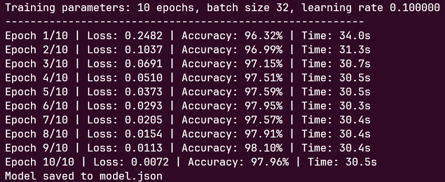
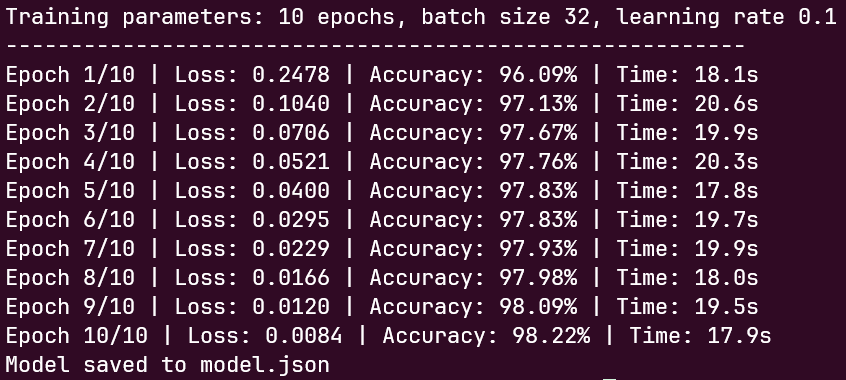
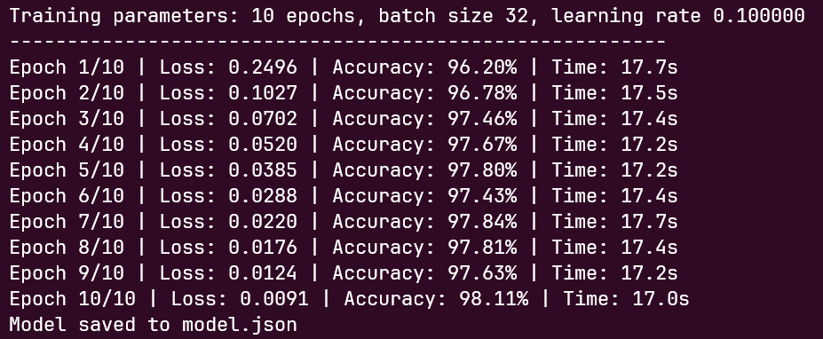

# stdlib MNIST

**[Try the Live Web UI](https://dhruvan2006.github.io/stdlib-mnist/)**

A custom Multilayer Perceptron (MLP) implementation from scratch to recognize handwritten digits from the MNIST dataset. 
The project extensively uses [stdlib](https://github.com/stdlib-js/stdlib) for math and linear algebra in JavaScript 
and achieves a **10% speedup over NumPy**.

All matrix operations, forward passes and backpropagation steps are powered purely by `@stdlib/blas` and `@stdlib/math` packages.

<p align="center">
  
  <br>
  <em>Figure 1 - Screenshot of the Web UI</em>
</p>

## `stdlib`

This project heavily relies on the modularity of `@stdlib`. Key packages include:
- **BLAS**: `@stdlib/blas-base-dgemv`, `@stdlib/blas-base-dger`, `@stdlib/blas-base-dscal`
- **Math**: `@stdlib/math-base-special-exp`, `@stdlib/math-base-special-max`, `@stdlib/constants-float64-ninf`
- **Utils**: `@stdlib/random-base-randu`, `@stdlib/string-format`

## Benchmark

The baseline is the JS fallback of `stdlib`. This was compared against `numpy` and `stdlib` (with native addons).

| Implementation | Total Time (10 Epochs) | Average Time / Epoch | Speedup |
| :--- | :--- | :--- | :--- |
| **Vanilla JS** (Baseline) | 309.0s | ~30.9s | 1.00x |
| **NumPy** | 191.7s | ~19.2s | 1.61x |
| **Stdlib Addons** | **173.7s** | **~17.4s** | **1.78x** |

While both NumPy and stdlib rely on native libraries to handle the heavy matrix math, stdlib's 10% edge over NumPy 
likely comes down to the fact that Node.js's V8 JIT compiler is generally faster at executing the surrounding 
high-level training loops compared to the CPython interpreter.

### Training Outputs

<table>
  <tr>
    <td align="center"><b>Stdlib (JS fallback)</b></td>
    <td align="center"><b>NumPy</b></td>
    <td align="center"><b>Stdlib (Native addon)</b></td>
  </tr>
  <tr>
    <td></td>
    <td></td>
    <td></td>
  </tr>
</table>

## Live Demo

**[Try the Live Web UI](https://dhruvan2006.github.io/stdlib-mnist/)**

## Installation

*Using JavaScript:*

```bash
git clone https://github.com/dhruvan2006/stdlib-mnist.git
cd stdlib-mnist
npm install
```

*Using Python:*

```bash
python3 -m venv .venv
source .venv/bin/activate
pip install -r requirements.txt
```

## Usage

### 1. Training the model

To train the neural network from scratch, run the training script. This script preprocesses the MNIST data, initializes an MLP with the architecture `[784, 256, 128, 10]`, and trains it over 10 epochs.

*Using JavaScript:*

```bash
npm run train
```

*Using Python:*

```bash
python3 train.py
```

The weights are saved to `model.json`.

### 2. Testing the model

To evaluate the model against the 10,000-image MNIST testing set:

*Using JavaScript:*

```bash
npm run test
```

*Using Python:*

```bash
python3 train.py --test
```

### 3. Running the Web UI

Use any simple HTTP server. For example: `npx serve .` or `python3 -m http.server`.

## License

This project is open-source and available under the [MIT License](./LICENSE).
